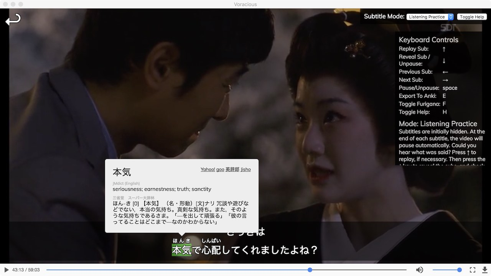

# Voracious

Voracious is a video player app for Mac/Windows/Linux with special features for studying foreign languages (esp. Japanese).



Voracious lets you:
- **Scan and browse** your media collection ala Kodi or Plex
- Simultaneously display **multiple subtitle languages/tracks** (all common formats supported)
- Quickly **replay** the current subtitle and navigate forward and back *by subtitle* using the keyboard
- Train your listen/reading/comprehension with **special viewing modes** that automatically pause and hide/reveal subtitles
- Automatically generate **furigana** annotations _(Japanese only)_
- Hover over words to see **dictionary definitions** _(Japanese only)_
- Import and use **EPWING** dictionaries _(limited to certain popular Japanese EPWINGs)_
- **Export subtitles as sentence cards** to Anki (with audio and/or image, ala [subs2srs](http://subs2srs.sourceforge.net/)), instantly via [AnkiConnect](https://ankiweb.net/shared/info/2055492159)
- _(coming soon)_ **Search for words/phrases** over your entire library of subtitles

Link to site with release: https://artemmezh.github.io/voraciousUpgrade/      

# Using Voracious (Quick Start)

Before using Voracious, you need to have a media collection that's organized and named the same way you would for Kodi or Plex _(each show/movie in its own directory, subtitle filename matching video filenames, etc.)_. Note that Voracious cannot currently play some popular video/audio codecs, including H.265 and AC3. Also, keep in mind that Voracious won't be useful unless you have subtitles in the language you're trying to learn.

If your media collection is ready to go, open Voracious and hit the *Add Collection* link. Select the folder where your collection lives, and give it name, and add it. On the Library page, you can browse your collection and play videos (videos without any available subtitles will appear grey). In the player, check the help overlay for keyboard controls, and try different subtitle modes.


# Development

## Overview and repo structure

Voracious is mostly built as a single-page web app with React (using `create-react-app`), and then packaged as a cross-platform desktop app using Electron. As with a normal electron app, the bulk of the code is in `src/` with some static resources in `resources/`. The output of webpack (after `npm run pachage`) will go into `release/build/`.

The application divided between `/src/main` and `/src/renderer`, according Electron application structure. `/src/main/` dir contains all staff for nodejs and OS. 

Most third-party dependencies are pure JS (`react`, `immutable`, etc.) and are declared in the root `package.json`.

Dependencies that use native code (e.g. `sqlite`) need to be compiled against the Electron V8 runtime, and are declared in `/release/app/package.json`. The corresponding `/release/app/node_modules/` _is_ packaged into the final distributed Electron app.


## Installing for development

To install for development you'll first need NodeJS (12v or higher), npm, and some extra build tools for node-gyp ([see here](https://github.com/nodejs/node-gyp)). Then:

```
$ npm install # install pure-JS and development dependencies
```

## Running in development mode

Start the app with:
```
$ npm start
```

## Building for release

```
$ yarn run package
```

The output archive/executable can then be found in the `/release/app/build` dir.


#Log
There was my log about upgrading process for electron to latest version.    
I am not fronted developer. I dont have experience in js or typescript or electron, but i want to create modern desktop application for learning language. So, here my log about knowledge which i get during upgrading application `voracious`.

My plan is copy and past chunk of code from main repository :) 

## Day 0
* It is bad practice to use native nodejs moduler in render process, so you should choose ipcRender instead
* remote module of electron is deprecated
* alias for types it is cool feature of typesctipe. For example `type Channel = 'channel-1' | 'channel-2''`
* more about invoke methods here https://github.com/electron/electron/issues/21408#issuecomment-564184702 or here https://stackoverflow.com/questions/69070320/how-to-get-the-current-browser-window-in-the-renderer-in-electron-14
* IPC (inter-process communication)
* modern guide about electron and ipc https://www.debugandrelease.com/the-ultimate-electron-guide/
* Add so many ipcMain handler for all staff like fs and path
* copy rest components from main repo
* ran into a problem with `...args` 
* there is why should not use electron/remote libs https://github.com/electron/remote

## Day 1
* In new electron showOpenDialog is async method   
  https://stackoverflow.com/questions/70331707/how-do-i-use-showopendialog-withe-electron-s-ipc
